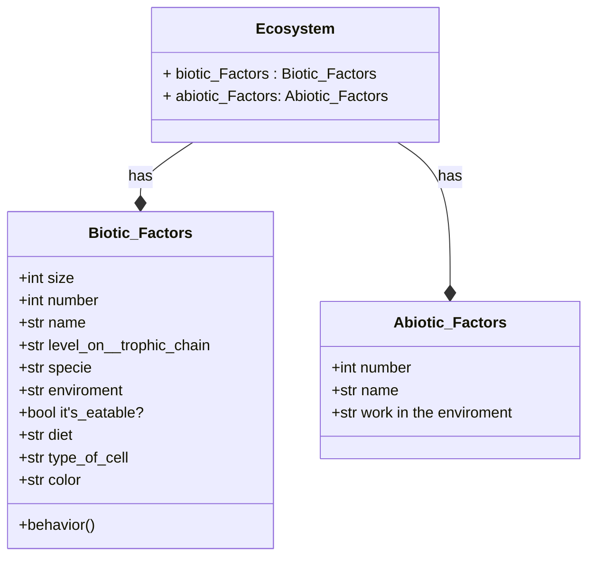
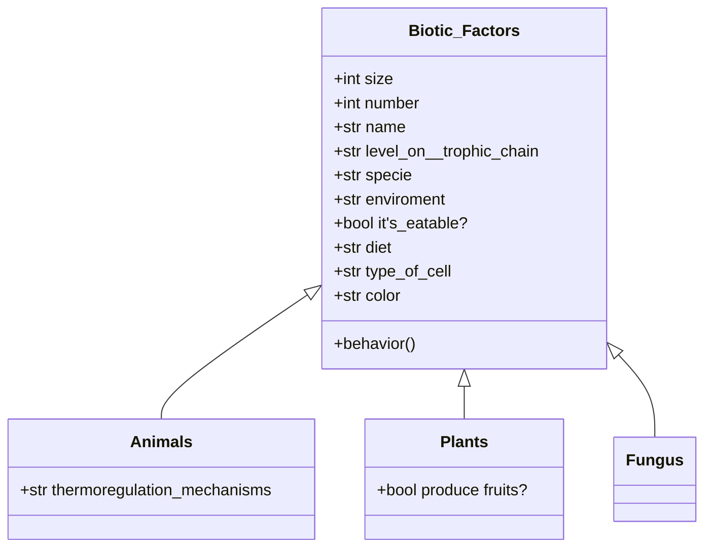

# Second_Challenge_OOP

**Relation between Ecosistem - Biotic and Abiotic factors**

```mermaid
classDiagram
    Ecosystem  --* Biotic_Factors: has
    Ecosystem  --* Abiotic_Factors: has

    class Ecosystem{
        + biotic_Factors : Biotic_Factors
        + abiotic_Factors: Abiotic_Factors
    }
         class Biotic_Factors{
      +int size
      +int number
      +str name
      +str level_on__trophic_chain
      +str specie
      +str enviroment
      +bool it's_eatable?
      +str diet
      +str type_of_cell
      +str color
      +behavior()
    }

   class Abiotic_Factors{
      +int number
      +str name
      +str work in the enviroment
    }

```

**Relation between Biotic factors- Animals, Plants and Fungus**

```mermaid
classDiagram
    Biotic_Factors  <|-- Animals
    Biotic_Factors  <|-- Plants
    Biotic_Factors  <|-- Fungus

    class Biotic_Factors{
      +int size
      +int number
      +str name
      +str level_on__trophic_chain
      +str specie
      +str enviroment
      +bool it's_eatable?
      +str diet
      +str type_of_cell
      +str color
      +behavior()
    }

    class Animals{
        +str thermoregulation_mechanisms
        
    }

    class Plants{
        +bool produce fruits?
    }

    class Fungus{
        
    }
```

